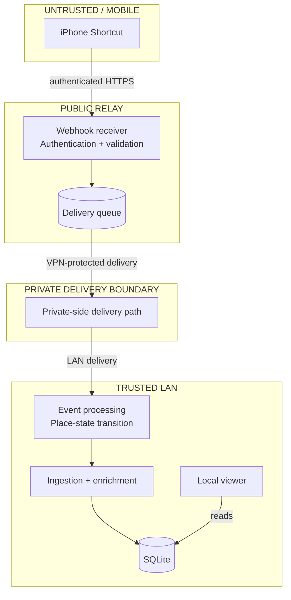
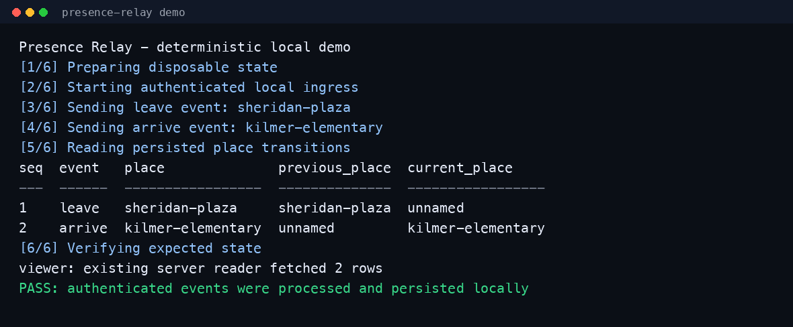
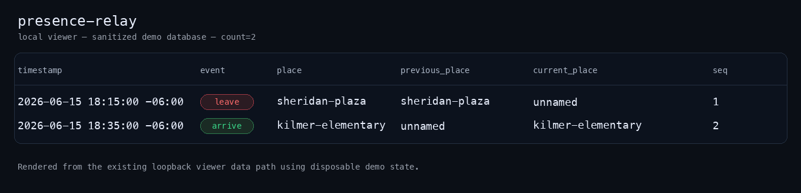

# Presence Relay

**Privacy-aware place-boundary event delivery across public and private infrastructure.**

Presence Relay is a real operational system for securely relaying named-place boundary events from a mobile device through a public relay to a trusted LAN target—without exposing internal services directly to the internet.

The system authenticates public ingress, keeps public and private responsibilities separated, models place transitions explicitly, and records enriched events in SQLite for local review.

A small boundary crossing in the physical world becomes a trusted, durable piece of protected system state.

```text
iPhone Personal Automation
  -> reusable Shortcut
    -> authenticated HTTPS webhook
      -> public relay
        -> private-side delivery path
          -> trusted LAN target
            -> logging and enrichment
              -> SQLite storage
                -> local viewer
```

The implemented system answers:

> Which named-place boundary was crossed, and what state transition occurred?

The documented roadmap asks a broader question:

> Given historical movement patterns, environmental conditions, scheduled events, and incomplete signals, what should the operator anticipate before leaving?

---

## Why This Exists

A mobile webhook is easy.

A trustworthy system that crosses public and private boundaries without exposing the trusted side is not.

Presence Relay grew from a real operational need to:

- accept authenticated events from a mobile device
- avoid direct public exposure of trusted LAN services
- deliver events across a deliberately separated private-side path
- distinguish event type from semantic place
- preserve useful state without publishing sensitive movement history
- support real operation while creating a disciplined foundation for later route and context inference

The project evolved through real use rather than artificial portfolio requirements.

A home-only `arrive` / `leave` model became a place-aware event model. A binary `home` / `away` state became arbitrary named places plus an intentional `unnamed` state. Individual boundary events then suggested route sessions, historical baselines, contextual observations, and explainable prediction.

That progression—from secure event delivery toward contextual anticipation—is the long-term direction of the project.

---

## Architecture

Presence Relay separates the public ingress surface from the trusted system that receives and uses the event.



### Security properties

The architecture is designed to avoid:

- inbound exposure of the trusted LAN target
- direct public access to internal services
- port-forwarded LAN automation endpoints
- mobile-client knowledge of private infrastructure details
- public storage of live credentials or movement history
- treating a public Git repository as a copy of the live system

The public relay and trusted LAN target have deliberately different responsibilities. The public side accepts and validates a narrowly defined event. The private side performs local processing, persistence, and review.

This is not merely a webhook script. It is a trust-boundary design.

See [Architecture Diagrams](docs/architecture-diagrams.md) for the full
trust-boundary, place-state, and local-demo diagrams.

---

## What Is Implemented

The current system includes:

- authenticated mobile webhook delivery
- public relay and trusted-LAN separation
- private-side event delivery
- named-place boundary events
- explicit place-state transitions
- local logging and enrichment
- SQLite persistence
- a local event viewer
- backward-compatible legacy fields
- sanitized deployment templates and examples
- public-release audit and sanitization tooling

The operational system has been exercised with real authenticated mobile boundary events; the public repository preserves that architecture while substituting sanitized configuration, synthetic data, and public reference geography.

---

## Place-State Model

The event model separates action from place:

```text
event = arrive | leave
place = arbitrary lowercase slug | unnamed
```

The public Chicago fixture demonstrates the model using:

```text
sheridan-plaza
kilmer-elementary
```

Example transitions:

```text
leave sheridan-plaza:
  previous_place = sheridan-plaza
  current_place  = unnamed

arrive kilmer-elementary:
  previous_place = unnamed
  current_place  = kilmer-elementary
```

`unnamed` is a legitimate observed state. It means the device is not currently associated with a named place or geofence.

It is not the same as `null`:

```text
unnamed = an observation exists, but no named place applies
null    = no observation exists
```

This distinction matters because fabricated state is worse than missing state.

Legacy fields remain available for compatibility, but the canonical model is place-aware:

```text
place
previous_place
current_place
```

See [Place State](docs/place-state.md) for the full transition rules.
The rendered [place-state diagram](docs/architecture-diagrams.md#place-state-transitions)
shows the same semantics without centering legacy compatibility fields.

---

## Public Reference Scenario

The repository uses a real public geography in Chicago as a stable, non-private reference fixture.

The scenario includes:

- **Sheridan Plaza** as one named endpoint
- **Kilmer Elementary** as another named endpoint
- **Loyola University Chicago Lake Shore Campus** and **Gentile Arena** as public context landmarks
- synthetic timestamps, observations, route samples, baselines, and inference results

The geography is real. The operational data is not.

This allows route, context, and inference designs to remain concrete without exposing private movement history.

See [Chicago Reference Scenario](docs/chicago-reference-scenario.md).

---

## Data Flow

A typical implemented event follows this path:

```text
1. A mobile automation detects an arrive or leave boundary.
2. A reusable Shortcut sends a small authenticated JSON payload.
3. The public relay validates the request.
4. The event crosses the configured private-side delivery path.
5. The trusted LAN target processes the transition.
6. The event is logged and enriched.
7. Structured data is stored in SQLite.
8. The local viewer presents the resulting event history.
```

Example payload:

```json
{
  "event": "leave",
  "place": "sheridan-plaza",
  "lat": 41.965647,
  "lon": -87.6546778,
  "ts": "2026-06-15T18:15:00-06:00"
}
```

All public payloads use synthetic timestamps and public-safe fixture data.

---

## Repository Layout

```text
app/                       Relay application code
clients/iphone-shortcuts/  Sanitized iPhone Shortcut documentation
docs/                      Architecture, models, threat analysis, and deployment notes
examples/                  Public-safe payload, route, context, and inference fixtures
nodes/public-relay/        Public relay deployment templates
nodes/home-lan-target/     Trusted LAN-side processing and viewer components
tools/audit/               Public-release and sanitization checks
```

The repository intentionally excludes live databases, logs, credentials, private routes, private infrastructure mappings, and editorial source material.

---

## Local Demonstration

Run the deterministic local demo:

```bash
./demo/bin/demo.sh
```

It exercises the implemented flow with disposable local state:

```text
synthetic named-place payloads
  -> authenticated local webhook
    -> local demo delivery adapter
    -> place-state transition
      -> ingestion and enrichment
        -> disposable SQLite database
          -> local viewer
```

The demo uses public Chicago fixtures, a clearly labeled non-secret demo token,
and no live infrastructure. It does not run roadmap features such as route
sessions, baselines, context correlation, inference, confidence scoring, or
recommendations.

The [local-demo flow diagram](docs/architecture-diagrams.md#local-demo-flow)
marks the demo-only adapter separately from the production private delivery
path.

### Visual Proof



The local demonstration exercises authenticated ingress, place-state
transitions, SQLite persistence, and viewer compatibility using disposable
public fixture data.



---

## Current Status and Roadmap

| Area | Status |
| --- | --- |
| Authenticated event relay | Implemented |
| Public/private trust-boundary separation | Implemented |
| Named-place event model | Implemented |
| Place-state transitions | Implemented |
| Logging and enrichment | Implemented |
| Weather enrichment | Implemented |
| Daylight and light-pattern enrichment | Implemented |
| SQLite storage | Implemented |
| Local viewer | Implemented |
| Route-session lifecycle | Designed |
| Route sampling | Designed |
| Historical route baselines | Designed |
| Broader context observations and events | Designed |
| Air-quality enrichment | Roadmap |
| Context and event correlation | Roadmap |
| Compound-context inference | Roadmap |
| Confidence scoring | Roadmap |
| Explainable recommendations | Roadmap |
| Custom iOS route collector | Roadmap |

Designed means a documented model or interface exists but is not yet operational. Roadmap means the direction is intended but not yet fully designed or implemented.

The repository keeps implemented behavior, verified operation, design work, and future roadmap visibly separate.

---

## From Boundary Events to Route Intelligence

A boundary event is useful by itself, but it becomes more valuable as part of an ordered sequence:

```text
leave sheridan-plaza
  -> unnamed movement window
    -> arrive kilmer-elementary
```

That sequence can become a route session:

```text
from_place
to_place
started_at
ended_at
duration_seconds
status
```

The documented route-session lifecycle includes:

```text
open
completed
expired
ambiguous
```

Route sessions, optional route samples, and historical baselines are design work rather than implemented production features.

The intended progression is:

```text
named-place boundary events
  -> route sessions
  -> optional route samples
  -> historical duration baselines
  -> environmental and event context
  -> explainable prediction
```

See [Route Sessions](docs/route-sessions.md) and [Route Data Model](docs/route-data-model.md).

---

## Context and Explainability

Potential context sources include:

- weather, daylight, and air quality
- temperature, wind, snow, and ice
- holidays, calendar effects, and recurring historical patterns
- public venue events
- graduations, concerts, parades, protests, construction, and road closures

The system is designed to keep these concepts separate:

```text
observation
correlation
hypothesis
confidence
causality
```

A weak signal should not be presented as proof. A future result may reasonably say:

> Similar sessions under these conditions were slightly slower. The observed relationship is correlational, the sample size is limited, and confidence is moderate.

It should not claim causality that the data cannot support. Operational conditions often change through overlapping weak signals rather than a single decisive alert. Recognizing those shifts without overstating certainty is valuable anywhere timing, context, and incomplete evidence matter.

See [Context Model](docs/context-model.md) and [Inference Model](docs/inference-model.md).

---

## Design Principles

### Treat privacy as architecture

Sanitization is not a final cleanup step. It affects schemas, logging, examples, screenshots, repository layout, deployment notes, and release tooling.

### Separate public and private responsibilities

The public repository preserves architecture and engineering judgment without becoming a map of the live deployment.

### Build from real workflows

Features emerge from observed operational needs rather than artificial demonstrations. The project is shaped by actual behavior, not only static design.

### Prefer useful boundaries over clever abstractions

`event` and `place` are separate because they represent different things. `unnamed` exists because “not at a named place” is not the same as “unknown.” A missing endpoint is `null`, not a fabricated place.

### Preserve explainability and separate signals from conclusions

A recommendation should include the observations and reasoning behind it, not only a score. Observations, correlations, hypotheses, confidence, and causality remain distinct. Implemented behavior, verified operation, documented design, and future roadmap must remain visibly separate.

### Deploy conservatively and verify in the real world

Public exposure is minimized, trusted systems remain private, and defaults favor loopback binding and explicit configuration. Operational behavior is verified under real conditions before broader conclusions are drawn.

---

## What This Project Demonstrates

Presence Relay demonstrates:

- trust-boundary security architecture and attack-surface reduction
- authenticated mobile event delivery across deliberately separated public and private responsibilities
- Linux service operation, shell tooling, and private-network integration
- explicit event and state modeling
- schema evolution and backward compatibility
- SQLite ingestion, enrichment, persistence, and local review
- threat modeling, OPSEC-aware publication, and reproducible sanitization
- iterative redesign grounded in operational verification

Route-session design and contextual inference remain visible as design work rather than implemented claims.

The underlying operating approach is:

> Understand how the system actually behaves, identify the important signals and boundaries, build the smallest useful mechanism, verify it under real conditions, and then extend it toward better anticipation.

---

## Threat Model and Publication Boundary

This repository is intentionally sanitized.

It does not publish:

- live credentials, tokens, keys, or certificate material
- production hostnames, infrastructure addresses, or private usernames
- machine-specific paths, exact personal routes, or raw movement history
- private family, home, school, or camp information
- live databases, logs, JSONL event streams, or private UI state
- deployment details that would expose the trusted environment

The public repository uses:

- placeholder credentials and reserved example domains
- loopback-safe defaults and sanitized configuration templates
- public Chicago geography
- synthetic timestamps, observations, and disposable demonstration data
- redacted audit output

The goal is to make the architecture, engineering judgment, and operational discipline visible without exposing the people or systems the project was built to protect.

See [Threat Model](docs/threat-model.md) and [Sanitization](docs/sanitization.md).

---

## Documentation

- [Architecture](docs/architecture.md)
- [Place State](docs/place-state.md)
- [Route Sessions](docs/route-sessions.md)
- [Route Data Model](docs/route-data-model.md)
- [Chicago Reference Scenario](docs/chicago-reference-scenario.md)
- [Context Model](docs/context-model.md)
- [Inference Model](docs/inference-model.md)
- [Threat Model](docs/threat-model.md)
- [Deployment](docs/deployment.md)
- [Sanitization](docs/sanitization.md)
