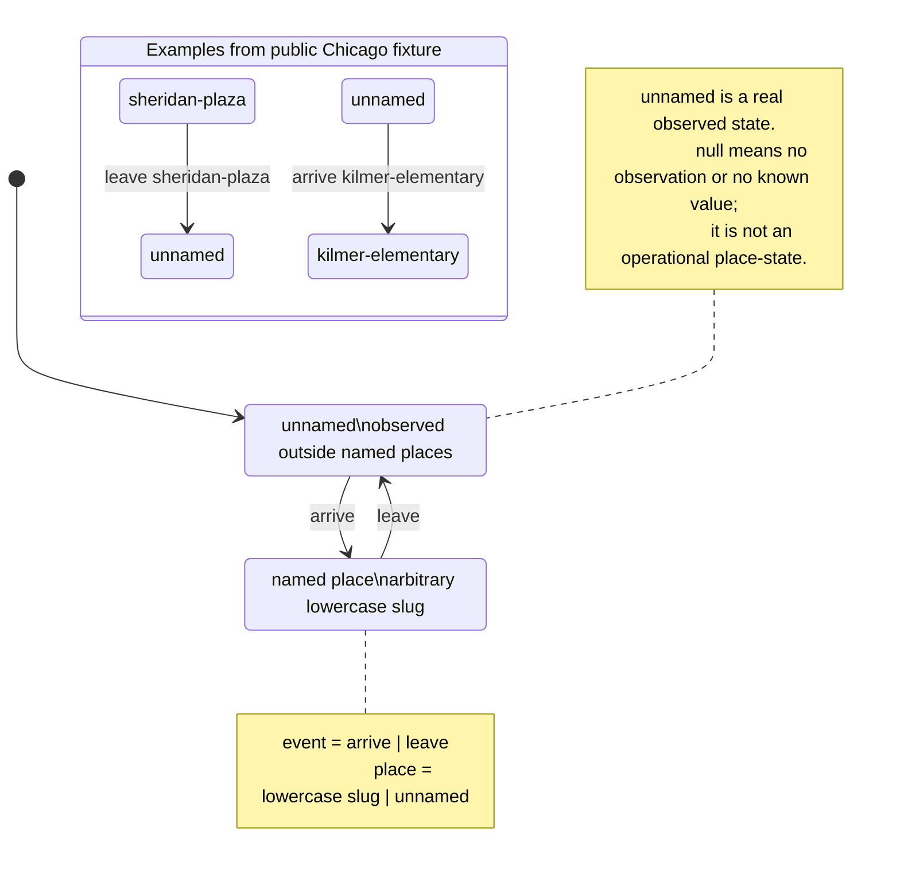

# Architecture Diagrams

A physical boundary crossing begins as a small signal. Presence Relay moves
that signal through deliberately separated trust domains until it becomes
durable local state.

These diagrams describe implemented behavior and the deterministic local demo.
They do not depict roadmap features as operational.

## Production Trust Boundary

The production architecture separates public ingress from trusted-side
processing. The public relay authenticates, validates, and queues accepted
events. The trusted LAN target remains behind the private delivery boundary and
creates the durable event history.

```mermaid
flowchart LR
	subgraph mobile["UNTRUSTED / MOBILE"]
		shortcut["iPhone Shortcut"]
		payload["arrive | leave JSON"]
	end

	subgraph relay["PUBLIC RELAY"]
		webhook["webhook receiver"]
		auth["authenticate request"]
		validate["validate event + place"]
		queue[("durable delivery queue")]
	end

	subgraph boundary["PRIVATE DELIVERY BOUNDARY"]
		delivery["controlled private-side delivery path"]
	end

	subgraph lan["TRUSTED LAN"]
		eventsh["event.sh processing"]
		transition["place-state transition"]
		ingest["ingest_enrich.py"]
		db[("trusted-side SQLite")]
		viewer["local viewer"]
	end

	shortcut -->|"authenticated HTTPS event"| payload
	payload --> webhook
	webhook --> auth
	auth --> validate
	validate --> queue
	queue --> delivery
	delivery --> eventsh
	eventsh --> transition
	transition --> ingest
	ingest --> db
	viewer -->|"reads local state"| db

	lan_note["trusted LAN target is not directly exposed publicly"]
	queue_note["relay validates and queues accepted events"]
	db_note["durable operational state is created on the trusted side"]

	lan_note -.-> lan
	queue_note -.-> queue
	db_note -.-> db

	classDef edge fill:#eef6ff,stroke:#5b7fa6,color:#111827
	classDef public fill:#fff7e6,stroke:#a66f00,color:#111827
	classDef boundary fill:#f7f7f7,stroke:#666,color:#111827,stroke-dasharray: 4 4
	classDef trusted fill:#ecfdf3,stroke:#2f7d4f,color:#111827
	classDef storage fill:#f5f3ff,stroke:#6d5bd0,color:#111827
	classDef note fill:#ffffff,stroke:#999,color:#111827,stroke-dasharray: 3 3

	class shortcut,payload edge
	class webhook,auth,validate public
	class delivery boundary
	class eventsh,transition,ingest,viewer trusted
	class queue,db storage
	class lan_note,queue_note,db_note note
```



Accuracy note: this is the production trust model. It intentionally omits real
hostnames, addresses, private topology, credentials, and roadmap inference
features.

## Place-State Transitions

The canonical state model separates action from place. Named places are
arbitrary lowercase slugs. `unnamed` is a real observed state outside all named
places; `null` means no observation or no known value.



Accuracy note: legacy `previous_status` and `new_status` fields still exist for
compatibility, but they are not the canonical place-state model.

## Local Demo Flow

The deterministic local demo exercises real implemented parsing,
authentication, place transition, ingestion, SQLite persistence, and viewer
reader compatibility. It uses a demo-only local adapter where production uses
the private delivery hop.

```mermaid
flowchart LR
	subgraph fixture["PUBLIC SYNTHETIC FIXTURES"]
		json["leave sheridan-plaza<br/>arrive kilmer-elementary"]
		token["non-secret demo token"]
	end

	subgraph loopback["LOOPBACK-ONLY LOCAL INGRESS"]
		webhook["real webhook handler"]
		auth["real authentication logic"]
		queue[("webhook queue")]
	end

	subgraph adapter["DEMO-ONLY ADAPTER"]
		drain["drain queued payloads"]
		call["invoke trusted-side script locally"]
	end

	subgraph trusted["REAL TRUSTED-SIDE PROCESSING"]
		eventsh["event.sh processing"]
		state["place-state transitions"]
		ingest["ingest_enrich.py"]
		db[("disposable SQLite<br/>demo/tmp/")]
		viewer["existing viewer reader<br/>compatibility check"]
	end

	json -->|"POST to 127.0.0.1"| webhook
	token --> auth
	webhook --> auth
	auth --> queue
	queue --> drain
	drain --> call
	call --> eventsh
	eventsh --> state
	state --> ingest
	ingest --> db
	viewer -->|"reads generated rows"| db

	note1["production SSH/private-delivery transport is not simulated or claimed"]
	note2["optional weather lookup disabled for deterministic local execution"]
	note3["no live or private infrastructure participates"]

	note1 -.-> adapter
	note2 -.-> ingest
	note3 -.-> loopback

	classDef demo fill:#eef6ff,stroke:#5b7fa6,color:#111827
	classDef public fill:#fff7e6,stroke:#a66f00,color:#111827
	classDef boundary fill:#f7f7f7,stroke:#666,color:#111827,stroke-dasharray: 4 4
	classDef trusted fill:#ecfdf3,stroke:#2f7d4f,color:#111827
	classDef storage fill:#f5f3ff,stroke:#6d5bd0,color:#111827
	classDef note fill:#ffffff,stroke:#999,color:#111827,stroke-dasharray: 3 3

	class json,token public
	class webhook,auth demo
	class drain,call boundary
	class eventsh,state,ingest,viewer trusted
	class queue,db storage
	class note1,note2,note3 note
```

Accuracy note: the demo is local-only, binds ingress to loopback, uses a
non-secret demo token, keeps runtime state under `demo/tmp/`, disables optional
weather lookup, and does not touch live infrastructure.
