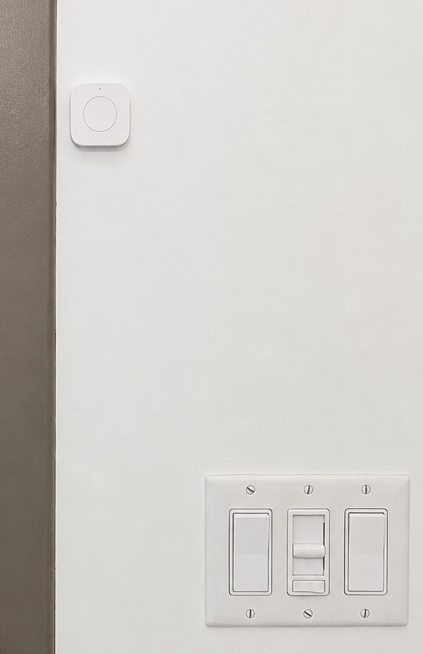

# Doorway Observations

Doorway observations are physical boundary signals recorded at the doorway
boundary. They complement phone-derived geofence transitions without replacing
them or silently manufacturing movement state.



The installed button is a quiet physical observation point at the doorway
boundary. It makes the environment carry a small procedural cue while keeping
the observation separate from interpretation.

The implemented path is deliberately narrow:

```text
physical doorway press
  -> home automation
  -> authenticated invocation
  -> narrow recorder
  -> raw observation store
  -> read-only operator query
```

The later analytical path is separate and remains future work:

```text
physical doorway press
  -> raw doorway observation
  -> later correlation with phone-derived geofence transitions
  -> possible journey-level interpretation
```

## Current Status

Implemented and verified:

- physical doorway button at the doorway boundary
- home automation trigger
- authenticated invocation into trusted local processing
- narrow recorder
- raw SQLite persistence
- read-only operator visibility

Not implemented yet:

- temporal correlation with phone-derived geofence transitions
- bounded matching windows
- confidence and ambiguity classification
- prevention of one-observation reuse across multiple transitions
- learned transition windows
- journey-level interpretation

The distinction matters. The physical signal records that something happened at
the doorway. It does not decide whether someone arrived, departed, changed
occupancy state, or caused a later geofence event.

## Raw Observation Contract

The raw doorway event is intentionally small and stable. It records facts that
can remain useful even as interpretation changes later.

Public-safe field shape:

| Field | Meaning | Kind | Privacy notes |
| --- | --- | --- | --- |
| `observed_at` | Time the physical press was observed | observed | public examples use synthetic timestamps |
| `observed_epoch` | Epoch representation of `observed_at` | observed/normalized | useful for ordering without exposing live values |
| `ingested_at` | Time the recorder persisted the row | system | public examples use synthetic timestamps |
| `device` | Stable public-safe device identity | observed/normalized | publish only abstract or example identifiers |
| `press_type` | Press classification from the button event | observed | examples use non-deployed values |
| `source` | Source class for the event | normalized | avoid automation account names or topology |
| `schema_version` | Raw observation schema version | metadata | supports later schema evolution |

The raw row deliberately does not include:

- arrival or departure
- journey direction
- occupancy state
- confidence
- geofence correlation
- causality

Meaning belongs to a derived layer. Keeping the raw record quiet allows future
correlation logic to improve without rewriting history.

See the synthetic example in
[`examples/observations/doorway-press.example.json`](../examples/observations/doorway-press.example.json).

## Relationship To Geofence Observations

The two signal streams answer different questions.

A phone-derived geofence observation asks:

```text
Which named place boundary did the mobile device report crossing?
```

A doorway observation asks only:

```text
Was the doorway button pressed, and when?
```

The physical observation point is valuable because it is anchored to the actual
doorway boundary. The phone-derived event is valuable because it reports a
named place-boundary transition from the mobile device. Neither signal should be
silently promoted into the other.

Future derived analysis may ask whether patterns line up:

```text
doorway press
  -> leave-home geofence transition

arrive-home geofence transition
  -> doorway press
```

That correlation is not implemented in the public model or represented as
deployed behavior here.

## Human Behavior

The system is designed for real use, not ritual-perfect input.

A forgotten press is not a system failure. It is missing evidence. A late press
or duplicate press is not proof of a clean story. It is a physical observation
that a later layer may or may not be able to use.

Future correlation should:

- use bounded temporal windows
- search for the nearest plausible doorway observation
- avoid reusing one doorway observation across multiple transitions
- tolerate late presses and duplicate presses
- preserve ambiguity rather than force a clean narrative
- classify results honestly

Possible future classifications:

```text
matched
no_plausible_press
ambiguous
outside_expected_window
```

This keeps the operator's burden small. The environment carries a modest
procedural cue at the doorway, while the operator is not required to open an app,
run a command, or maintain perfect input discipline.

## Security And Publication Boundary

The doorway signal originates inside the protected environment and is recorded
locally. No LAN service is exposed merely to support the button. The public
ingress boundary for phone-derived geofence events remains separate from the
protected processing node.

Public documentation may describe:

- physical doorway observation
- home automation
- authenticated invocation
- protected home-LAN processing node
- narrow recorder
- local SQLite event store
- read-only operator query
- raw observation and derived correlation

Public documentation must not publish:

- operational credentials or automation account details
- device identifiers from the deployed environment
- private hostnames, IP addresses, usernames, paths, or database locations
- exact event timestamps, live rows, logs, or database counts
- residence identifiers, building details, or access-control details
- unreviewed installation photographs

Published installation photographs should be public-safe derivatives with
metadata stripped, neutral filenames, and no visible residence identifier,
signage, reflections, network details, or materially useful access-control
detail.
